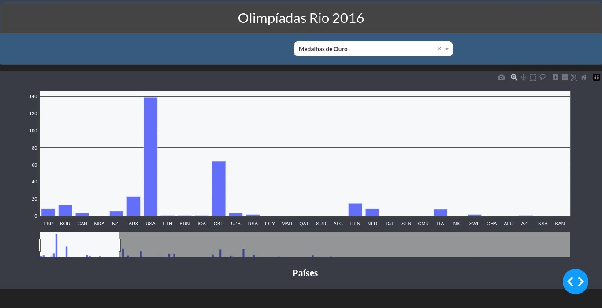
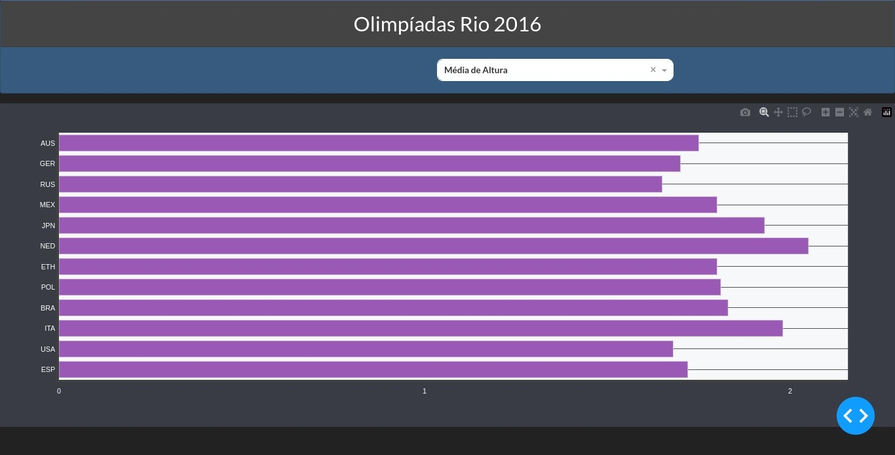
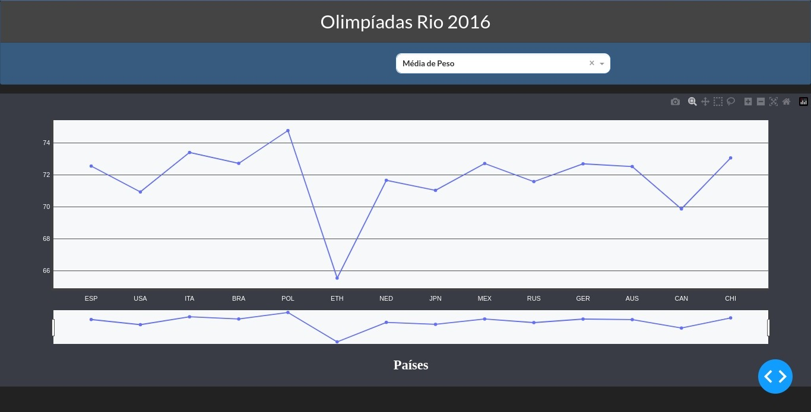
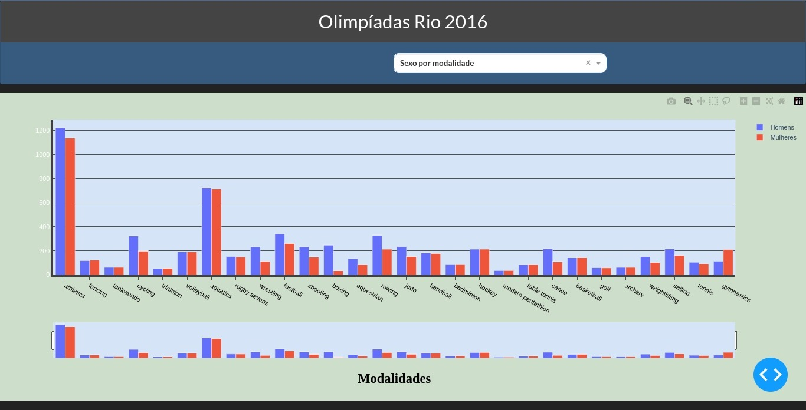
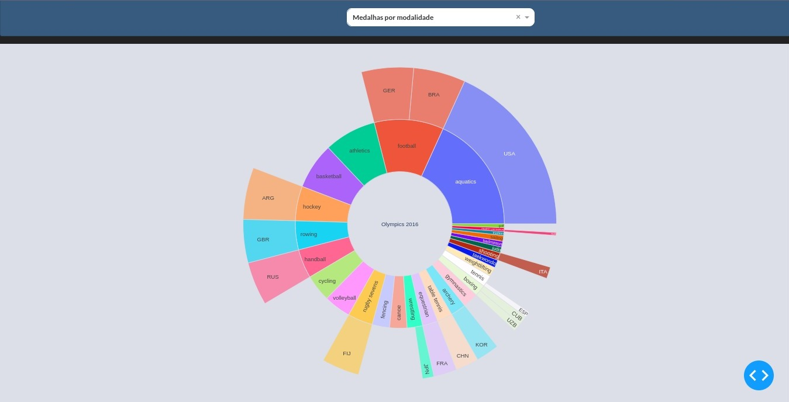

# Olympics 2016 Dashboard

## About the project

Made in the discipline of Algorithms and Computer Programming at the University of Brasilia.

The dashboard made is intended to show the user different data about the 2016 Olympics.

## Running the project locally

### Requisitos
- python 3.x
- pip (If you are using the latest version of Python, _pip_ is probably already installed by default)
- virtualenv

If you don't have virtualenv installed, use the following command:

```terminal
$ pip install virtualenv
```

### Uso

Para rodar localmente é preciso entrar na virtualenv com o comando:

```terminal
$ source venv/bin/activate
```
OBS: If you want to exit virtualenv once it is activated, perform the following command:

```terminal
$ deactivate
```

Once this is done, we can now actually run the project with the following command:

```terminal
$ python -i olympics2016-dashboard/PyProject.py    
```
## Screenshots

In this graph, it is shown about the gold medals of all countries that participated in the Olympics:



The average height of the participants:



The average weight: 



Still on the participants, the gender classification of each athlete is defined here:



In the last graph, the medal count by sport that each country obtained is shown:

